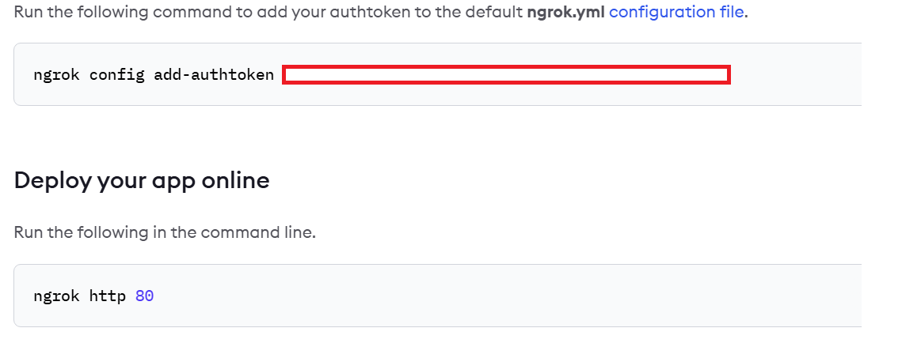
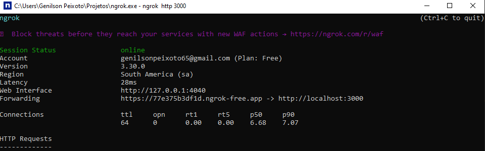

# 1. Clone o repositório
git clone https://github.com/GenPXM/essentiaIA.git
no terminal acesse a api com cd api_scheduling 

# 2. Instale as dependências
npm install

# 3.Arquivo env
tem um arquivo .env.example pré configurado com o banco de dados PostgreSql
esse banco de dados é online e pode ser usado sem a necessidade de usar um banco local.
url do banco online https://neon.com/ , se quiser criar um novo login precisa entrar com a conta 
e obter a chave do banco e substituir pela que esta cadastrada em DATABASE_URL na env.

crie um arquivo .env para colocar as envs do exemplo nele. 

# 4.Iniciar APi 
no terminal ainda no api_scheduling rode o comando npm run start
se estiver tudo certo vc deve ver uma mensagem assim:

API rodando em: http://localhost:3000
Swagger disponível em: http://localhost:3000/api

# 5.Migrations

Comandos no terminal para migrations no api_scheduling

| Ação                       | Comando                      |
| -------------------------- | ---------------------------- |
| Criar nova migration       | `npm run migration:create`   |
| Gerar migration automática | `npm run migration:generate` |
| Executar migrations        | `npm run migration:run`      |
| Reverter última migration  | `npm run migration:revert`   |

# 6.Testes unitários 
No terminal ainda em api_scheduling você pode rodar a execução dos testes 
com o comando:

npm run test:watch

modo observação 
npm run test:watch

modo relatório de cobertura 
npm run test:cov

# 7.Ngrok para Api se comunicar com o N8N 
Configurar um Ngrok para tornar a Api acessivel externamente, abaixo segue algumas configurações 
caso necessário:

Acesse: https://ngrok.com/download
Baixe o arquivo de acordo com SO
Extraia e coloque o executável no PATH

Crie uma conta gratuita no https://dashboard.ngrok.com e copie seu Token.
deve ser algo assim

execute o Ngrok instalado em sua maquina e rode o comando 
ngrok config add-authtoken <SEU_TOKEN>
em seguida rode o comando 
ngrok http 3000 
observar se a api esta iniciada com a porta 3000, se não for troque no comando pela porta da api.

vai gerar algo assim 

e então copie https://77e375b3df1d.ngrok-free.app essa parte que aparece no painel e substitua 
nos nodes de HTTPS do N8N que são responsaveis para requisição para a API. 

# 7. Tecnologias utilizadas

NestJS
TypeORM
PostgreSQL ou SQLite
Swagger (Documentação da API)
Jest + ts-jest (Testes)
ts-node-dev (Dev rápido)